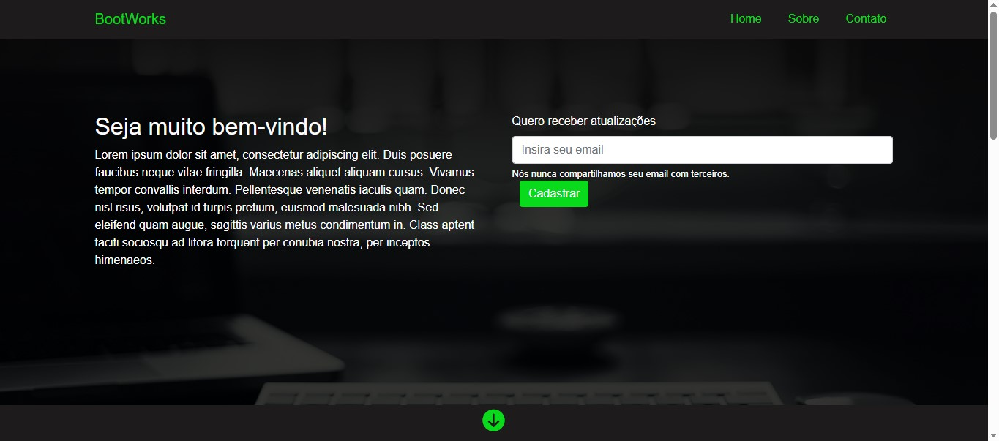

# BootWorks - Landing Page

Este repositório contém o código da **Landing Page da BootWorks**, uma agência de tecnologia e inovação.  
O projeto foi desenvolvido com foco em **responsividade**, **acessibilidade** e **interatividade**, utilizando **HTML**, **CSS** e **Bootstrap 4**.

## Índice

- [Visão Geral](#visão-geral)
  - [O Desafio](#o-desafio)
  - [Captura de Tela](#captura-de-tela)
  - [Links](#links)
- [Meu Processo](#meu-processo)
  - [Tecnologias Usadas](#tecnologias-usadas)
  - [O Que Aprendi](#o-que-aprendi)
- [Autor](#autor)

---

## Visão Geral

### O Desafio

O desafio consistiu em criar uma **landing page moderna e responsiva** para apresentar os serviços de uma agência digital.  
A página inclui:
- Menu fixo no topo com rolagem suave até as seções  
- Sessão de boas-vindas com formulário de cadastro  
- Modal informativo na seção “Sobre”  
- Cards com diferenciais e ícones interativos  
- Formulário de contato funcional  
- Rodapé com links sociais  

### Captura de Tela




*A imagem acima mostra a versão final da landing page em dispositivos desktop e mobile.*

---

### Links

- **Site ao vivo:** [https://SEU-LINK-DE-DEPLOY-AQUI](https://SEU-LINK-DE-DEPLOY-AQUI)  
- **Solução no GitHub:** [https://github.com/dhBarankievicz/anding-page-bootstrap](https://github.com/dhBarankievicz/landing-page-bootstrap)  

---

## Meu Processo

### Tecnologias Usadas

- **HTML5** — Estrutura semântica e acessível  
- **CSS3** — Estilização com seletores personalizados  
- **Bootstrap 4** — Layout responsivo e componentes reutilizáveis  
- **Font Awesome 6** — Ícones modernos e leves  
- **jQuery** — Suporte a modais e interações do Bootstrap  

---

### O Que Aprendi

Durante o desenvolvimento deste projeto, aprimorei meus conhecimentos em:
- Criação de **layouts responsivos** com o sistema de grid do Bootstrap  
- Uso de **overlays e parallax** para efeitos visuais modernos  
- Implementação de **modais dinâmicos** e botões com **efeitos hover**  
- Estruturação de páginas com foco em **experiência do usuário (UX)**  

Exemplo de estilização do botão com hover:
```css
button[type=submit] {
  background-color: rgb(9, 218, 27);
  border: none;
}

button[type=submit]:hover {
  background-color: rgb(9, 190, 24);
}

## Autor

**👨‍💻 Douglas Barankievicz**  

🔗 [GitHub](https://github.com/dhBarankievicz)  
🔗 [LinkedIn](https://linkedin.com/in/douglas-barankievicz-a42132358)
